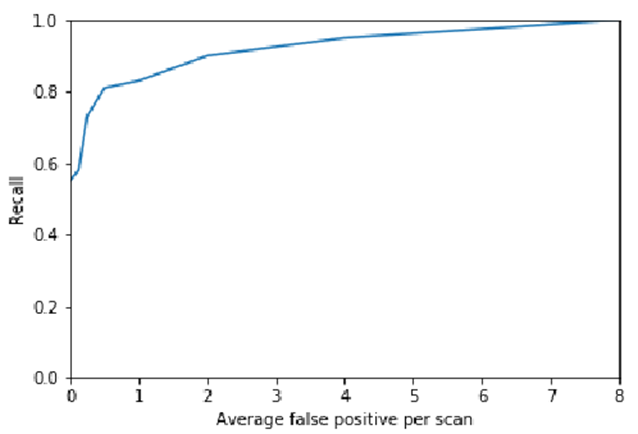
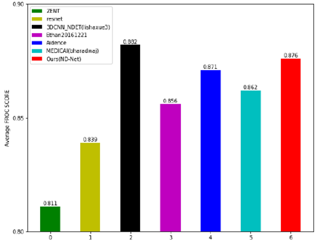

1. Test environment: The test environment is shared by the three projects
    python:3.6.5
    cudatoolkit: 10 (9 should also work. The version used during testing is 10)
    ubuntu/windows
    Main dependencies and available versions:
    pytorch 1.2.0 (1.0.1 and above should also work. The version used during testing is 1.2.0)
    pydicom 1.2.2
    simpleITK 1.2.4
    lifeline 0.24.12
    numpy 1.18.1
    opencv-python 4.2

2. Test Data
    The input data of this project is part of the output of the detectorhit project, so you need to run the detectorhit project before running this project.
3. Test steps
3.1 Manually modify the configuration file
    tracer/config_tracer.py: You need to manually modify detector_path and tracer_path to be the absolute paths of the detectorhit project and the tracer project respectively.
3.2 Run
    Run tracer/main_local.py. (You need to run the detecotrhit project first.)
3.3 Result Output
    The output result is in cover_2d_out. For each input image xx_origin.jpg, there will be a corresponding xx_cover.jpg and xx_overlay.jpg. xx_cover.jpg is the pixel point in the predicted input image that causes the node to be a malignant node, and xx_overlay.jpg is the merged image of xx_cover and xx_origin.
